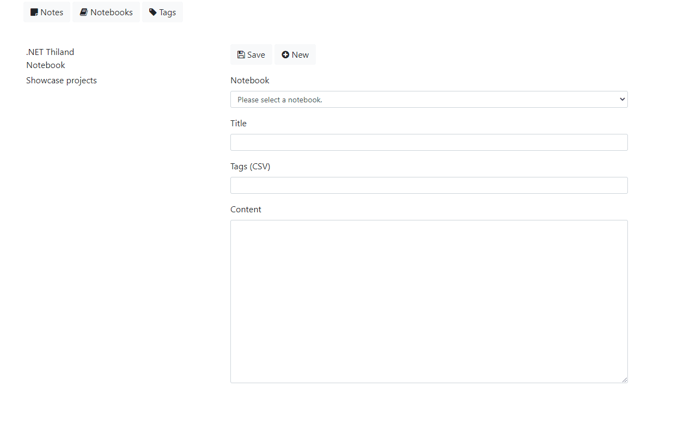

# codesanook-ef-note

## How to run the project locally
- Fork this project
- Clone the project to your computer.
```sh
git clone git@github.com:{your-github-username}/codesanook-ef-note.git
```
!!! Change **{your-github-username}** to your GitHub username

- CD to to the root folder.

```sh
cd codesanook-ef-note
```

- Launch Docker containers.
```sh
docker-compose down --volumes; docker-compose up --build
```

- Wait for a while until you see dotnet watch messages, e.g.
```sh
web_1  | info: Microsoft.Hosting.Lifetime[0]
web_1  |       Now listening on: http://[::]:8000
```
- Open a browser and navigate to http://localhost:8000/
- You will find a simple note app that you can 
  - Add a new notebook which is a group/container of each note  
  - Add a new note.
  - Add a new tag.
  - Update/Delete notebook, note and tag.

## Hot reload
- Edit some C# source code in `app` folder. 
- Code will be compile automatically.
- Refresh a browser and see what you have changed.

## EF Note in a browser 


## Release compose for testing only
```sh
docker-compose down --volumes; docker-compose -f docker-compose.yml -f docker-compose.release.yml up --build
```

## Production release

### Create a new App Service
- Create Azure App Service with a container
- Use DockerHub registry and `mcr.microsoft.com/dotnet/samples:aspnetapp` image
- Check log in deployment, open a browser and navigate to https://{your-app-service-name}.azurewebsites.net/
- You should find an example ASP.NET Core MVC app 

### Set some configurations 
- Set these configurations:
  - `WEBSITE_WEBDEPLOY_USE_SCM` 
    - `true`
  - `WEBSITES_PORT` 
    - `8000`
  - `WEBSITES_PORT` 
    - `true`
  - `CONNECTIONSTRINGS__DEFAULTCONNECTION` 
    - `Server={your-server-name}.mysql.database.azure.com; Port=3306; Database={your-database-name}; Uid={your-username}@{your-server-name}; Pwd={your-password}; SslMode=Preferred;CharSet=utf8mb4;`

### Create DockerHub repository and get a new token
- Create a public DockerHub repository
- Get DockerHub token from Account Settings > Security > New Access Token

### Create GitHub secret
- Download publish profile from your App Service and use it a value of AZURE_WEBAPP_CONTAINER_PUBLISH_PROFILE secret
- Create these GitHub secrets with their values:
  - AZURE_WEBAPP_CONTAINER_PUBLISH_PROFILE
  - AZURE_WEBAPP_NAME
  - DOCKERHUB_REPOSITORY
  - DOCKERHUB_TOKEN
  - DOCKERHUB_USERNAME

### Trigger GitHub Actions
- Go to GitHub Action tab and enable it
- Create new commit and push the project to the main branch

## Debugging
- CD to `app` folder and launch run with debugging with VS Code `.NET Core launch (web)`
- Start only a database  container
```sh
docker-compose up db
```

## TODO
- [ ] Improve code quality
- [ ] Use async/await
